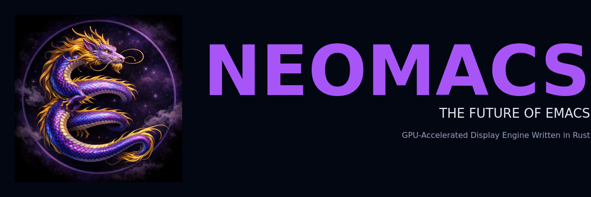

<p align="center">
   
</p>

<p align="center">
  <a href="#features"></a>
  <a href="#building"></a>
  <a href="#license"></a>
</p>

---

## The Problem

Emacs's display engine (~50,000 lines of C in `xdisp.c`) was designed for text terminals in the 1980s. Despite decades of patches, it fundamentally struggles with:

- **Large images** — rendering slows down significantly
- **Video playback** — not natively supported
- **Modern animations** — no smooth cursor movement, buffer transitions, or visual effects
- **Web content** — limited browser integration
- **GPU utilization** — everything runs on CPU while your GPU sits idle

## The Solution

Throw it all away and start fresh.

**Neomacs** replaces Emacs's entire display subsystem with a modern **Rust + GPU** architecture:

- **~4,000 lines of Rust** replacing ~50,000 lines of legacy C
- **GTK4/GSK** scene graph for hardware-accelerated rendering
- **Zero-copy DMA-BUF** for efficient GPU texture sharing
- **cosmic-text** for pure-Rust text shaping
- **Full Emacs compatibility** — your config and packages still work

---

## Features

### ✅ Working Now

| Feature | Description |
|---------|-------------|
| **GPU Text Rendering** | Hardware-accelerated text via GTK4/GSK (Vulkan/OpenGL/Metal) |
| **WebKit Browser** | Embedded web views with zero-copy DMA-BUF rendering |
| **Video Playback** | GStreamer integration with hardware decode (VA-API) |
| **Cursor Animations** | Neovide-style effects: railgun, torpedo, pixiedust, sonicboom, ripple |
| **Smooth Scrolling** | Animated scroll with configurable easing |
| **Buffer Transitions** | Fade/slide effects when switching buffers |
| **DMA-BUF Zero-Copy** | GPU-to-GPU texture sharing (no CPU readback) |

### 🎯 The Ambitious Vision

Neomacs aims to transform Emacs from a text editor into a **modern graphical computing environment**:

**Rich Media First-Class Citizen**
- 4K/HDR video playback directly in buffers
- Interactive web content — YouTube, documentation, web apps
- PDF rendering with GPU acceleration
- Image manipulation and annotation

**GPU-Native Everything**
- Hardware-accelerated rendering for all content
- Shader effects (blur, shadows, glow)
- 120fps smooth animations
- Minimal CPU usage, maximum battery life

**Modern UI/UX**
- Neovide-style cursor animations
- Buffer transition effects
- Smooth scrolling everywhere
- Window animations and effects

**Beyond Text**
- Embed any GTK4 widget in buffers
- Interactive diagrams and visualizations
- Real-time collaboration widgets
- Native terminal emulation with GPU rendering

**Cross-Platform Excellence**
- Linux (Wayland & X11)
- macOS (Metal backend)
- Windows (Vulkan/D3D via GTK4)

The goal: **Make Emacs the most powerful and beautiful computing environment on any platform.**

---

## Architecture

```
┌─────────────────────────────────────────────────────────────┐
│                     Emacs Core (C/Lisp)                     │
└─────────────────────────┬───────────────────────────────────┘
                          │ FFI
┌─────────────────────────▼───────────────────────────────────┐
│                 Rust Display Engine                         │
│  ┌─────────────┐  ┌─────────────┐  ┌─────────────────────┐  │
│  │ Text Engine │  │ Animations  │  │ Media (WebKit/Video)│  │
│  │ cosmic-text │  │ cursor/     │  │ WPE + GStreamer     │  │
│  │ + atlas     │  │ transitions │  │ DMA-BUF textures    │  │
│  └──────┬──────┘  └──────┬──────┘  └──────────┬──────────┘  │
│         └────────────────┼────────────────────┘             │
│                          ▼                                  │
│              ┌───────────────────────┐                      │
│              │   GTK4/GSK Renderer   │                      │
│              │   (GPU Scene Graph)   │                      │
│              └───────────┬───────────┘                      │
└──────────────────────────┼──────────────────────────────────┘
                           ▼
              ┌───────────────────────┐
              │  Vulkan/OpenGL/Metal  │
              └───────────────────────┘
```

### Why Rust?

- **Memory safety** without garbage collection
- **Zero-cost abstractions** for high-performance rendering
- **Excellent FFI** with C (Emacs core)
- **Modern tooling** (Cargo, async, traits)
- **Growing ecosystem** for graphics (cosmic-text, gtk4-rs)

---

## Quick Demo

### Embedded WebKit Browser

```elisp
;; Initialize WebKit subsystem
(neomacs-webkit-init)

;; Create a browser view
(setq my-browser (neomacs-webkit-create 800 600))
(neomacs-webkit-load-uri my-browser "https://github.com")

;; Display as floating overlay
(neomacs-webkit-floating my-browser 50 50 800 600)

;; Or embed inline in buffer
(insert (propertize " " 'display
  (neomacs-insert-webkit "https://example.com" 400 300 t)))
```

### Video Playback

```elisp
;; Insert video directly in buffer
(insert (propertize " " 'display
  `(neomacs-video :file "/path/to/video.mp4"
                  :width 640 :height 360)))
```

---

## Building

### Prerequisites

- **Emacs source** (this is a fork)
- **Rust** (stable, 1.70+)
- **GTK4** development libraries
- **GStreamer** (optional, for video)
- **WPE WebKit** (optional, for browser)

### Linux (Debian/Ubuntu)

```bash
# Install dependencies
sudo apt install \
  build-essential autoconf automake \
  libgtk-4-dev libgstreamer1.0-dev \
  libgstreamer-plugins-base1.0-dev \
  libwpewebkit-2.0-dev libwpebackend-fdo-1.0-dev

# Build
./autogen.sh
./configure --with-neomacs-display
make -j$(nproc)
```

### Nix

```bash
# Enter development shell
nix-shell

# Build
./autogen.sh
./configure --with-neomacs-display
make -j$(nproc)
```

---

## Project Structure

```
neomacs/
├── rust/neomacs-display/     # Rust display engine
│   ├── src/
│   │   ├── core/             # Types, animations, scene graph
│   │   ├── backend/gtk4/     # GTK4/GSK GPU renderer
│   │   ├── backend/wpe/      # WebKit integration
│   │   ├── text/             # cosmic-text + glyph atlas
│   │   └── ffi.rs            # C FFI layer
│   └── Cargo.toml
├── src/                      # Emacs C source (with Rust hooks)
├── lisp/neomacs-webkit.el    # Elisp WebKit API
└── doc/display-engine/       # Design documentation
```

---

## Contributing

Contributions welcome! Areas where help is needed:

- **Graphics programmers** — shader effects, rendering optimizations
- **Rust developers** — architecture, performance, safety
- **Emacs hackers** — Lisp API design, integration testing
- **Documentation** — tutorials, API docs, examples

See [doc/display-engine/DESIGN.md](doc/display-engine/DESIGN.md) for architecture details.

---

## Acknowledgments

Built with:
- [GTK4](https://gtk.org/) / [gtk4-rs](https://gtk-rs.org/) — GPU rendering backend
- [cosmic-text](https://github.com/pop-os/cosmic-text) — Pure Rust text shaping
- [WPE WebKit](https://wpewebkit.org/) — Embedded browser engine
- [GStreamer](https://gstreamer.freedesktop.org/) — Video playback
- Inspired by [Neovide](https://neovide.dev/) cursor animations

---

## License

GNU General Public License v3.0 (same as Emacs)
